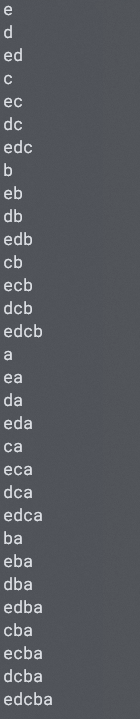

1 & 0 = 0 // 不进位 -> 0 = 0 << 0
```

完整代码如下

```c++
#include <iostream>
#include <bitset>
#include <climits>
#include <cstring>

#define N 8

using namespace std;

int main() {
    int n;
    scanf("%d", &n);

    char e[] = {'a', 'b', 'c', 'd', 'e'};

    /* 空间开销较大，选择在堆上分配内存 */

    bitset<N> *flag = new bitset<N>(); // 用于记录子集状态
    bitset<N> *one = new bitset<N>(1); // 0...01，用于相加
    bitset<N> *zero = new bitset<N>(); // 0...00，用于比较

    // 为a加1准备的变量
    bitset<N> *_and = new bitset<N>(*flag & *one);
    bitset<N> *_xor = new bitset<N>(*flag ^ *one);
    bitset<N> *t1 = new bitset<N>();
    bitset<N> *t2 = new bitset<N>();
    
    // 用于查询flag中为1的位置
    bitset<N> *cursor = new bitset<N>(1);

    bool isEnd = false;
    while (!isEnd) {
        if (flag->count() == n) {
            isEnd = true; // 执行完这轮循环
        }

        /* 检测为1的位置 */
        ////////////////////////////START
        for (int i = sizeof(e)-1; i >= 0; i--, *cursor <<= 1) {
            if ((*flag & *cursor) != *zero) {
                printf("%c", e[i]);
            }
        }
        *cursor = 1;
        ////////////////////////////END

        printf("\n");


        /* a加1 */
        ////////////////////////////START
        while (_and->any()) {
            *t1 = *_xor;
            *t2 = *(_and) << 1;
            *_and = *t1 & *t2;
            *_xor = *t1 ^ *t2;
        }
        *flag = *_xor;  
        ////////////////////////////END
        
        *_and = *flag & *one;
        *_xor = *flag ^ *one;
    }

    delete flag, one, zero, _and, _xor, t1, t2, cursor;

    return 0;
}
```

运算结果

